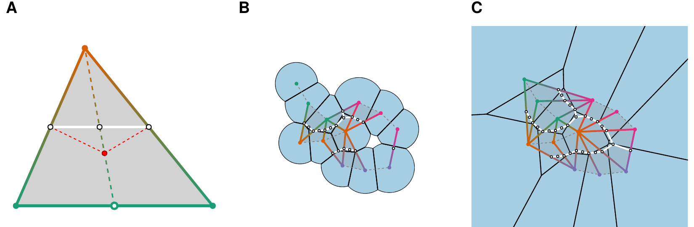
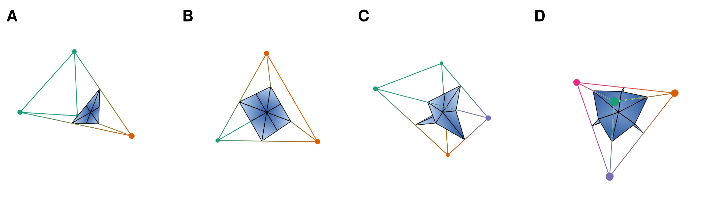
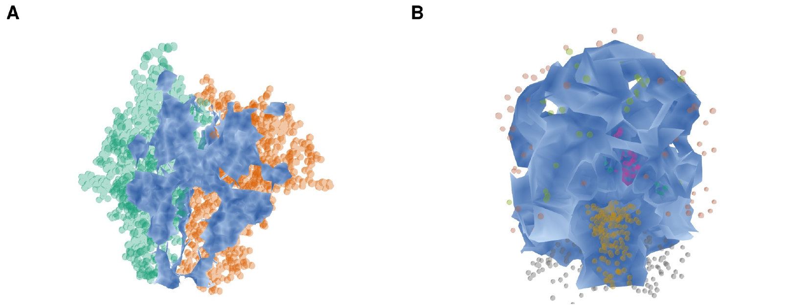

# The Interface Surface Construction

This document describes the interface surface construction implemented in
this library.
---

## 1. Setting

We are given a labeled point cloud in general position in $\mathbb{R}^3$,
where labels *color* the different components of the system. Optionally each
point carries a weight, used to build a weighted Delaunay triangulation or
alpha complex. The construction itself is dimension-agnostic and works
verbatim in $\mathbb{R}^2$ (the 2D figures below illustrate this), but the
implementation is 3D only.

Formally: points $P = \lbrace p_1, \dots, p_n\rbrace \subset \mathbb{R}^3$ with weights
$W = \lbrace w_1, \dots, w_n\rbrace \subset \mathbb{R}$ and a coloring
$c : P \to \lbrace 1, \dots, k\rbrace$.

## 2. Weighted Voronoi, Delaunay, and alpha complex

The $i$-th *weighted Voronoi cell* is

$$V(p_i, w_i) := \lbrace x \in \mathbb{R}^3 \mid \pi_{p_i, w_i}(x) \leq \pi_{p_j, w_j}(x)\ \forall j\rbrace,$$

with power distance $\pi_{p,w}(x) = \lVert x - p\rVert^2 - w$. Its dual (under general
position) is the *weighted Delaunay triangulation*. When each point carries a
radius $r_i > 0$, we set $w_i = r_i^2$ and restrict each cell to the ball
$B(p_i, r_i)$, i.e. $R(p_i, w_i) = V(p_i, w_i) \cap B(p_i, r_i)$; the *weighted
alpha complex* is

$$\mathcal{A}(P, W) = \lbrace \sigma \subseteq P \ :\ \bigcap_{p_i \in \sigma} R(p_i, w_i) \neq \emptyset\rbrace.$$

With uniform radii $r$ the weighted alpha complex equals the unweighted alpha
complex with parameter $\alpha = r^2$.

## 3. Multicolored simplices

Let $K$ be the (three-dimensional) Delaunay or alpha complex and
$c$ the vertex coloring. The construction operates on the set of all
*multicolored* simplices

$$F = \lbrace \sigma \in K \mid |c(\sigma)| > 1\rbrace,$$

i.e. simplices whose vertices span at least two colors. For such a simplex
we write $\sigma^j = \lbrace v \in \sigma \mid c(v) = j\rbrace$ for its *mono-colored
subsets*, one per color $j$ present in $\sigma$.

## 4. The interface surface

The interface surface is a simplicial complex $I$ built as follows.

**Vertices.** For each $\sigma \in F$ add one vertex

$$v_\sigma = \frac{1}{|\lbrace \sigma^j \mid \sigma^j \neq \emptyset\rbrace|} \sum_{j=1,\ \sigma^j \neq \emptyset}^{k} b(\sigma^j),$$

where $b(\sigma^j)$ is the barycenter of the mono-colored subset $\sigma^j$ —
i.e. the vertex sits at the *barycenter of the barycenters* of the
mono-colored subsets of $\sigma$. This color-aware placement (rather than the
plain barycenter of $\sigma$) is what smoothes the interface
(subfigure A of the following figure, in two dimensions).

**Edges.** $v_\sigma$ and $v_\tau$ are connected by an edge iff one of
$\sigma, \tau$ is a proper face of the other in $K$.

**Higher simplices.** $I$ is the flag complex on the resulting graph: a
triangle is included iff all three of its edges are, and so on.

$|I|$ separates the connected components of $|K|$ into regions containing at
most one color each.

Within a generating $d$-simplex the interface is $(d-1)$-dimensional.

*(A) A multicolored triangle separated by the white interface line defined by
barycenters of its mono-colored subsets; the plain barycenter of the triangle
is shown in red for comparison. (B) The construction on an alpha complex of
four molecules. (C) The same on the full Delaunay triangulation.*

In 2D a triangle admits two color splits (2-1 and 1-1-1). In 3D there are four
splits of a tetrahedron:

*Colorings of a tetrahedron and the resulting interface pieces: (A) 3-1 split,
(B) 2-2 split, (C) 2-1-1 split, (D) 1-1-1-1 split. Shading indicates distance
of the surface from the generating vertices.*

## 5. Filtration values

Each vertex of $I$ is assigned a *filtration value* measuring local
separation between the color classes it mediates. For a vertex $v$
corresponding to the sub-partition $(S'_1, \dots, S'_m)$ with part barycenters
$\beta'_j = b(S'_j)$:

$$f(v) = \binom{m}{2}^{-1} \sum_{1 \leq j < l \leq m} \lVert \beta'_j - \beta'_l\rVert,$$

the average pairwise distance between the part barycenters. Values extend to
edges and triangles by a star filtration:

- **Upper star** (default): $f(\sigma) = \min_{v \in \sigma} f(v)$ — a simplex
  enters as soon as *any* vertex is reached (superlevel-set / descending
  analysis).
- **Lower star**: $f(\sigma) = \max_{v \in \sigma} f(v)$ — a simplex enters
  once *all* vertices are reached (standard sublevel-set filtration satisfying
  the subface condition, suitable for persistent homology).

## 6. Final interface

The final interface surface is the union of the subdivisions over all
multicolored simplices and itself a filtered simplicial complex.

*Multicolored point clouds with interface surfaces between them shown in blue.
(A) A trimer of the human CD40 ligand-receptor complex (PDB ID: 1aly), one
molecule removed for visualization; the interface lies inside the volume water
cannot reach. (B) A brain scan from the mindboggle dataset, with an interface
surface separating the different regions.*
