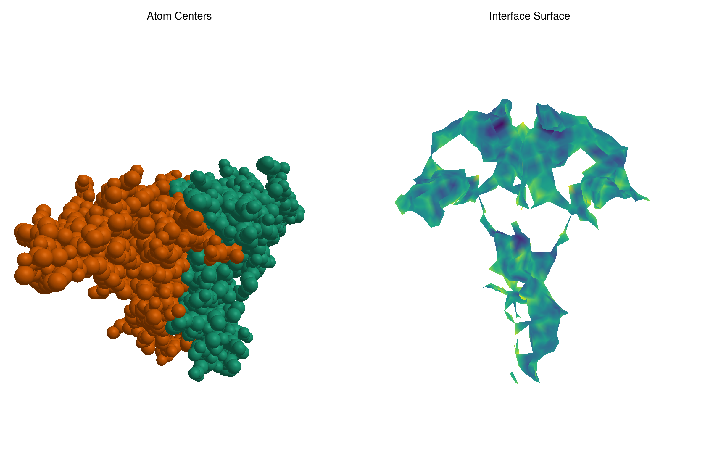
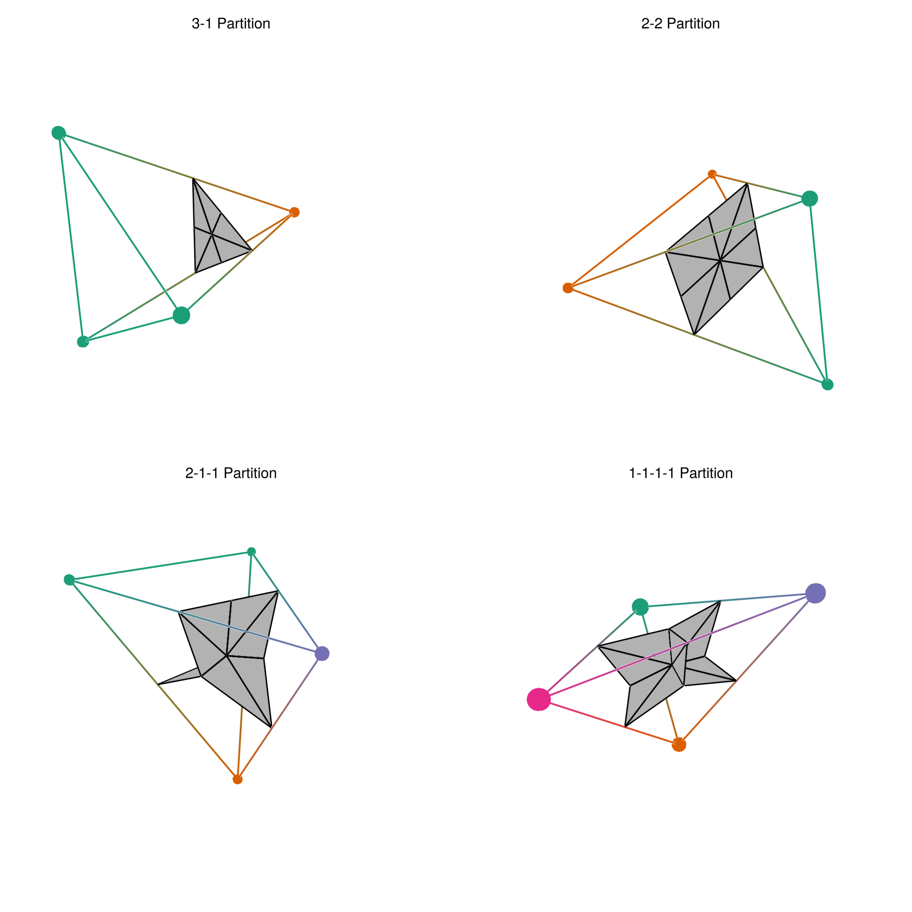

# Delaunay Interfaces

Compute interface surfaces between colored regions in 3D point clouds using barycentric subdivisions of multicolored tetrahedra of a (weighted) Delaunay triangulation.
The surface is triangulated by construction and endowed with a filtration based on the distance of the surface to the generating points.

An example is given in the above figure, where the points are atom centers of a Hepatitis-B protein dimer (PDB Id: 4bmg). Here the surface was constructed on a sub-complex of the Delaunay triangulation (the Alpha complex) defined by the atom radii increased by the radius of water. Yellow regions on the interface surface correspond to relatively close, dark regions to relatively distant generating points.

An interactive visualization is available on [my website](https://ivanspirandelli.github.io).

## Algorithm

1. **Delaunay/Alpha Complex**: Compute triangulation using CGAL
2. **Filter Multicolored Tetrahedra**: Keep only tetrahedra with ≥2 colors
3. **Chromatic Partition**: Group vertices by color within each tetrahedron
4. **Barycentric Subdivision**: Create interface simplices from partition barycenters
5. **Filtration Values**: Assign values based on distances between color barycenters

The algorithm works for any number of colors. Below is a visualization of the four colorings a single multicolored tetrahedron can have.
The construction is written in C++. Bindings for Julia and Python are available. See the rest of the README for build instructions.



## Quick Start: Running the Examples

The easiest way to explore the library is through the Jupyter notebooks in `examples/`.

### Prerequisites

Install the C++ dependencies:

**macOS:**
```bash
brew install cmake cgal eigen
```

**Ubuntu/Debian:**
```bash
sudo apt-get install cmake libcgal-dev libeigen3-dev
```

### Build the Library

Both Python and Julia bindings are built by default. Since Julia bindings require CxxWrap, you need to provide its path:

1. Install Julia dependencies:
```julia
using Pkg
Pkg.add(["CxxWrap", "IJulia", "GLMakie"])
```

2. Get the CxxWrap prefix path:
```julia
using CxxWrap
CxxWrap.prefix_path()  # Copy this path
```

3. Clone and build:
```bash
git clone https://github.com/IvanSpirandelli/delaunay-interfaces.git
cd delaunay-interfaces
mkdir build && cd build
cmake -DCMAKE_PREFIX_PATH=/path/from/step/2 ..
make -j4
```

4. Register the Julia package:
```julia
using Pkg
Pkg.develop(path="path/to/delaunay-interfaces/julia")
```

**Python only (no Julia):** If you don't need Julia bindings, you can skip the CxxWrap setup:
```bash
git clone https://github.com/IvanSpirandelli/delaunay-interfaces.git
cd delaunay-interfaces
mkdir build && cd build
cmake -DBUILD_JULIA_BINDINGS=OFF ..
make -j4
```

### Building Options

| Option | Default | Description |
|--------|---------|-------------|
| `BUILD_PYTHON_BINDINGS` | ON | Build Python module |
| `BUILD_JULIA_BINDINGS` | ON | Build Julia wrapper (requires CxxWrap) |
| `BUILD_TESTS` | ON | Build test suite |

### Python Notebook

1. Create a virtual environment and install dependencies:
```bash
cd delaunay-interfaces  # project root
python3 -m venv venv
source venv/bin/activate
python3 -m pip install numpy matplotlib jupyter
```

2. Start Jupyter and open the notebook:
```bash
jupyter notebook examples/python_examples.ipynb
```

3. Run all cells. The notebook demonstrates:
   - Random point cloud interfaces
   - Single tetrahedron subdivisions (2-2, 2-1-1, 3-1, 1-1-1-1 partitions)
   - Protein dimer interface (4BMG)

### Julia Notebook

Start Jupyter and open the notebook:
```bash
jupyter notebook examples/julia_examples.ipynb
```

## API

### Python

```python
import delaunay_interfaces as di

points = [[0, 0, 0], [1, 0, 0], [0, 1, 0], [0, 0, 1]]
colors = [1, 1, 2, 2]

gen = di.InterfaceGenerator()

# Unweighted Delaunay (default is weighted=True, alpha=True)
surface = gen.compute_interface_surface(points, colors, radii=[], weighted=False, alpha=False)

# Or with radii for weighted alpha complex
radii = [0.5, 0.5, 0.5, 0.5]
surface = gen.compute_interface_surface(points, colors, radii)

# surface.vertices: Nx3 numpy array of barycenter coordinates
# surface.filtration: list of (simplex_indices, filtration_value) pairs
#   - len(simplex) == 1: vertex
#   - len(simplex) == 2: edge
#   - len(simplex) == 3: triangle (interface surface)
```

### Julia

```julia
using DelaunayInterfaces

points = [[0.0, 0.0, 0.0], [1.0, 0.0, 0.0], [0.0, 1.0, 0.0], [0.0, 0.0, 1.0]]
colors = [1, 1, 2, 2]

# Unweighted Delaunay (no radii)
surface = InterfaceSurface(points, colors)

# Or with radii for weighted alpha complex
radii = [0.5, 0.5, 0.5, 0.5]
surface = InterfaceSurface(points, colors, radii)

# Explicit options
surface = InterfaceSurface(points, colors, radii; weighted=true, alpha=false)

# surface.vertices: Vector of 3D coordinates
# surface.filtration: Vector of (simplex, value) tuples
```

⚠️ **Note:** The C++ library returns 0-based indices. The Julia wrapper automatically converts them to 1-based indices to follow Julia conventions. Keep this in mind when comparing output between C++ and Julia.

### C++

```cpp
#include <delaunay_interfaces/interface_generation.hpp>

delaunay_interfaces::InterfaceGenerator gen;
auto surface = gen.compute_interface_surface(points, colors, radii, weighted, alpha);
```

## Dependencies

- C++17 compiler
- CMake ≥ 3.15
- [CGAL](https://www.cgal.org/)
- [Eigen3](https://eigen.tuxfamily.org/)
- [pybind11](https://github.com/pybind/pybind11) (auto-downloaded)
- [CxxWrap.jl](https://github.com/JuliaInterop/CxxWrap.jl) (for Julia)

## Questions?

Don't hesitate to reach out to ivan [at] spirandelli [dot] de