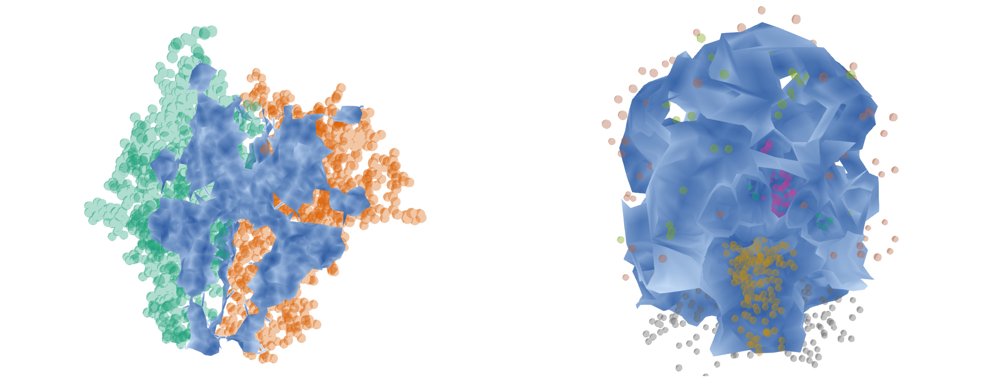
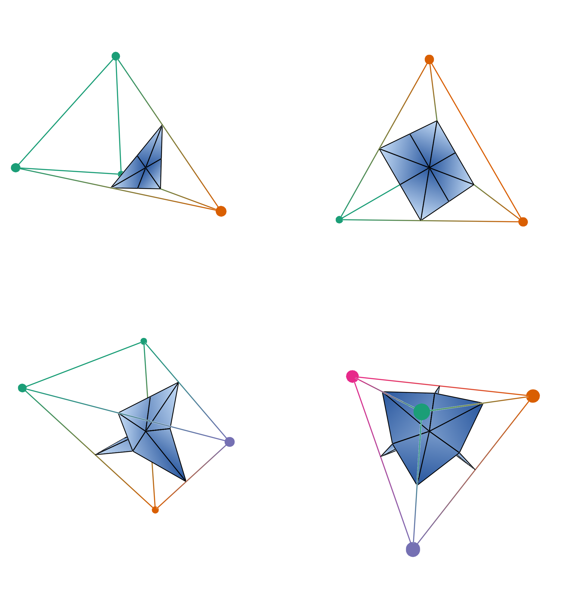
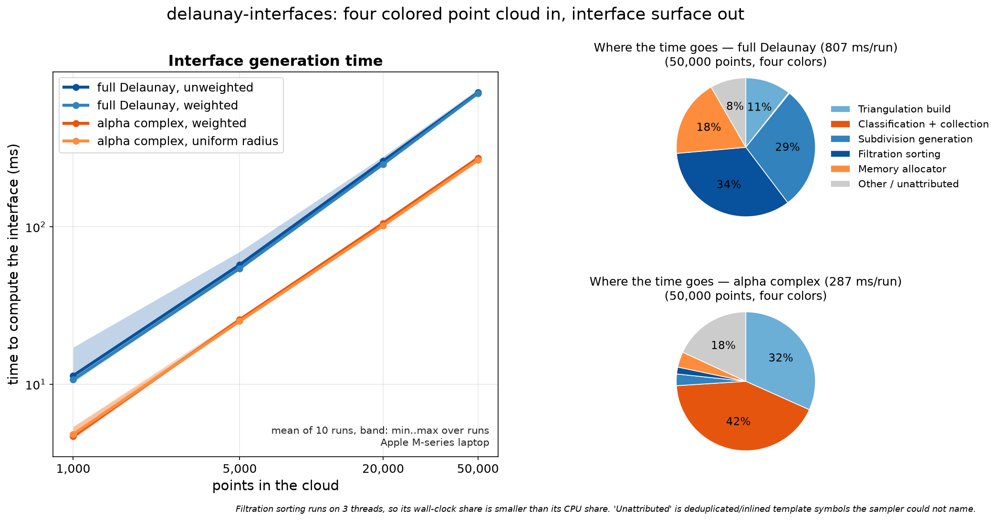

# Delaunay Interfaces

Compute interface surfaces between colored regions in 3D point clouds using barycentric subdivisions of multicolored simplices of a (weighted) Delaunay triangulation.
The surface is triangulated by construction and endowed with a filtration based on the distance of the surface to the generating points.

An example is given in the above figure. On the left side, the colored points represent two subunits of a protein trimer of a human ligand, the third subunit
was removed to reveal the interface surface constructed between the subunits. The interface surface is shown in a white to blue gradient. Blue regions on the interface surface correspond to relatively close, white regions to relatively distant generating points. Here the surface was constructed on a sub-complex of the Delaunay triangulation (the Alpha complex) defined by the atom radii increased by the radius of water. The image on the right shows an interface of a brain scan, where differently colored parts of the point cloud correspond to different brain regions.

An interactive visualization is available on [my website](https://ivanspirandelli.github.io).

## Algorithm

1. **Delaunay/Alpha Complex**: Compute triangulation using CGAL
2. **Filter Multicolored Simplices**: Keep the simplices with ≥2 colors — tetrahedra, plus triangles and edges not contained in any kept tetrahedron
3. **Chromatic Partition**: Group vertices by color within each simplex
4. **Barycentric Subdivision**: Create interface simplices from partition barycenters
5. **Filtration Values**: Assign values based on distances between color barycenters

The algorithm assumes points in general position and works for any number of colors. Below is a visualization of the four possible colorings of a multicolored tetrahedron and the corresponding interfaces. Larger interfaces are pieces like these glued together along edges defined by incident generating tetrahedra. Free triangles and edges contribute the analogous lower-dimensional pieces — short edge fans and single points — where the complex contains no multicolored tetrahedron, as at alpha complex boundaries.
The interface construction is written in C++. Bindings for Julia and Python are available. See the rest of the README for build instructions.



## Quick Start: Running the Examples

The easiest way to explore the library is through the Jupyter notebooks in `examples/`.
Standalone script examples for each language live there too: `cpp_api.cpp` (built as the
`cpp_api` executable), `python_api.py`, and `julia_api.jl`. The notebook
`julia_alpha_to_interface_illustration.ipynb` walks through the alpha-complex-to-interface
construction step by step.

### Prerequisites

Install the C++ dependencies:

**macOS:**
```bash
brew install cmake cgal eigen
```

**Ubuntu/Debian:**
```bash
sudo apt-get install cmake libcgal-dev libeigen3-dev
```

### Build the Library

Both Python and Julia bindings are built by default (can be turned off, see below). Since Julia bindings require CxxWrap, you need to provide its path:

1. Install Julia dependencies:
```julia
using Pkg
Pkg.add(["CxxWrap", "IJulia", "GLMakie"])
```

2. Get the CxxWrap prefix path:
```julia
using CxxWrap
CxxWrap.prefix_path()  # Copy this path
```

3. Clone and build:
```bash
git clone https://github.com/IvanSpirandelli/delaunay-interfaces.git
cd delaunay-interfaces
mkdir build && cd build
cmake -DCMAKE_PREFIX_PATH=/path/from/step/2 ..
make -j4
```

4. Register the Julia package:
```julia
using Pkg
Pkg.develop(path="path/to/delaunay-interfaces/julia")
```

**Python only (no Julia):** If you don't need Julia bindings, you can skip the CxxWrap setup:
```bash
git clone https://github.com/IvanSpirandelli/delaunay-interfaces.git
cd delaunay-interfaces
mkdir build && cd build
cmake -DBUILD_JULIA_BINDINGS=OFF ..
make -j4
```

### Building Options

| Option | Default | Description |
|--------|---------|-------------|
| `BUILD_PYTHON_BINDINGS` | ON | Build Python module |
| `BUILD_JULIA_BINDINGS` | ON | Build Julia wrapper (requires CxxWrap) |
| `BUILD_TESTS` | ON | Build test suite |
| `BUILD_EXAMPLES` | ON | Build the C++ example (`cpp_api`) |

### Python Notebook

1. Create a virtual environment and install dependencies:
```bash
cd delaunay-interfaces  # project root
python3 -m venv venv
source venv/bin/activate
python3 -m pip install numpy matplotlib jupyter
```

2. Start Jupyter and open the notebook:
```bash
jupyter notebook examples/python_api_and_visualization.ipynb
```

3. Run all cells. The notebook demonstrates:
   - Random point cloud interfaces
   - Single tetrahedron subdivisions (2-2, 2-1-1, 3-1, 1-1-1-1 partitions)
   - Protein dimer interface (4bmg)

### Julia Notebook

The Julia notebooks activate the `julia/` project environment; install its dependencies once with:
```julia
using Pkg
Pkg.activate("path/to/delaunay-interfaces/julia")
Pkg.instantiate()
```

Then start Jupyter and open the notebook:
```bash
jupyter notebook examples/julia_api_and_visualization.ipynb
```

The notebook contains the same examples as the python notebook, but with interactive visualizations.

### Extended Julia Example

`examples/julia_extended.ipynb` is a larger interactive showcase: a tabbed GLMakie figure with tetrahedron partition variants, protein assembly interfaces (4BMG, 6Z4U, 1ALY), and a brain segmentation interface with a filtration slider. Its input data ships with the repo in `examples/julia_extended_data.json`; computed surfaces are cached locally in a gitignored `.jld2` file on first run.

## API

### Python

```python
import delaunay_interfaces as di

points = [[0, 0, 0], [1, 0, 0], [0, 1, 0], [0, 0, 1]]
colors = [1, 1, 2, 2]

gen = di.InterfaceGenerator()

# Unweighted Delaunay (no radii)
surface = gen.compute_interface_surface(points, colors)

# Or with radii for weighted alpha complex
# (alpha defaults to True whenever radii are given)
radii = [0.5, 0.5, 0.5, 0.5]
surface = gen.compute_interface_surface(points, colors, radii)

# Or with a single radius for the uniform alpha complex (parameter radius^2)
surface = gen.compute_interface_surface(points, colors, radius=0.5)

# surface.vertices: Nx3 numpy array of barycenter coordinates
# surface.filtration: list of (simplex_indices, filtration_value) pairs
#   - len(simplex) == 1: vertex
#   - len(simplex) == 2: edge
#   - len(simplex) == 3: triangle (interface surface)
```

### Julia

```julia
using DelaunayInterfaces

points = [[0.0, 0.0, 0.0], [1.0, 0.0, 0.0], [0.0, 1.0, 0.0], [0.0, 0.0, 1.0]]
colors = [1, 1, 2, 2]

# Unweighted Delaunay (no radii)
surface = InterfaceSurface(points, colors)

# Or with radii for weighted alpha complex
# (alpha defaults to true whenever radii are given)
radii = [0.5, 0.5, 0.5, 0.5]
surface = InterfaceSurface(points, colors, radii)

# Weighted Delaunay without alpha filtering
surface = InterfaceSurface(points, colors, radii; alpha=false)

# Or with a single radius for the uniform alpha complex (parameter radius^2)
surface = InterfaceSurface(points, colors, 0.5)

# surface.vertices: Vector of 3D coordinates
# surface.filtration: Vector of (simplex, value) tuples
```

⚠️ **Note:** The C++ library returns 0-based indices. The Julia wrapper automatically converts them to 1-based indices to follow Julia conventions. Keep this in mind when comparing output between C++ and Julia.

### C++

```cpp
#include <delaunay_interfaces/interface_generation.hpp>

delaunay_interfaces::InterfaceGenerator gen;

// Unweighted Delaunay
auto surface = gen.compute_interface_surface(points, colors);

// Weighted alpha complex
auto weighted_surface = gen.compute_interface_surface(points, colors, radii);

// Uniform alpha complex from a single radius (parameter radius^2)
auto uniform_surface = gen.compute_interface_surface(points, colors, 0.5);
```

## Profiling

The figure below shows the cost of `compute_interface_surface` (point cloud in, interface surface out) 
on uniform random four-color clouds
(four colors exercise every chromatic partition shape a tetrahedron can
have). Each point is the mean of 10 runs on an Apple M-series laptop, the
band the min–max spread across those runs; both axes are logarithmic, so the
parallel straight lines mean near-linear scaling in practice. The weighted
variants use per-point radii jittered ±20% around half the cloud's median
filtration scale, which is also the radius of the uniform alpha variant. The
pie charts break one 50,000-point computation per pipeline into its main
phases, measured with a sampling profiler on the library call alone.



The two constructions hit different bottlenecks because
they feed the subdivision very different volumes. The full Delaunay calculation
subdivides every multicolored tetrahedron of the whole triangulation (at
50,000 four-color points: hundreds of thousands of tetrahedra, millions of
filtration entries), so barycentric subdivision and filtration sorting
dominate. The alpha complex at half the median scale keeps only a few
thousand generating simplices, so its time goes into building the same
50,000-point triangulation and classifying every facet and edge against the
alpha threshold, while subdivision and sorting are nearly free. As the alpha
radius approaches the maximal circumradius occurring in the Delaunay
triangulation, the alpha complex fills in toward the full complex and converges
toward the full Delaunay profile.

To regenerate: `benchmarks/visualization/` contains the measurement driver
(`readme_bench.cpp`, build line in its header), the plot script
(`readme_performance.py`, needs matplotlib), and the profile snapshot data.

## Dependencies

- C++17 compiler
- CMake ≥ 3.15
- [CGAL](https://www.cgal.org/)
- [Eigen3](https://eigen.tuxfamily.org/)
- [pybind11](https://github.com/pybind/pybind11) (auto-downloaded)
- [CxxWrap.jl](https://github.com/JuliaInterop/CxxWrap.jl) (for Julia)

## Questions?

Don't hesitate to reach out to ivan [at] spirandelli [dot] de